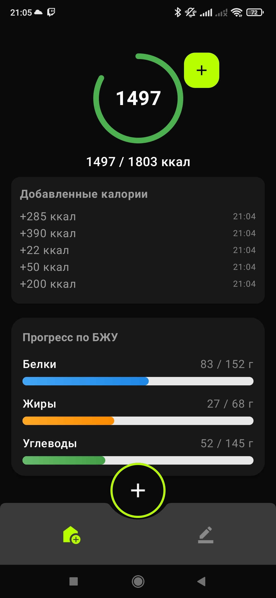
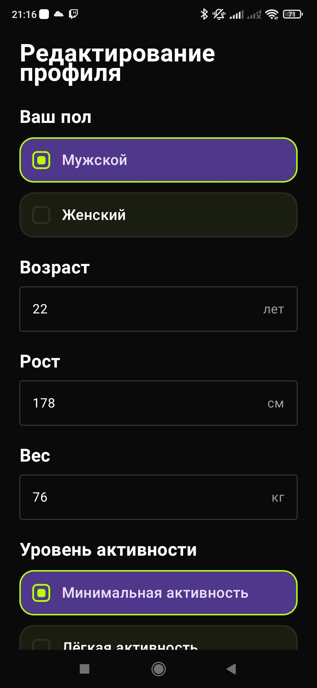
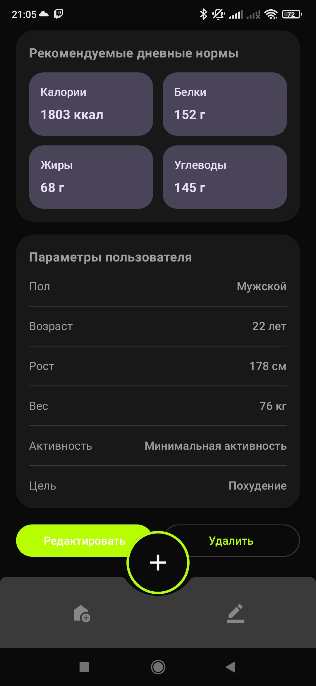
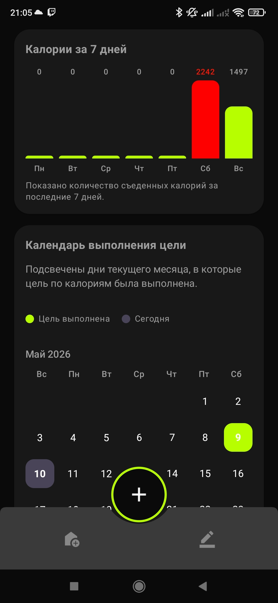
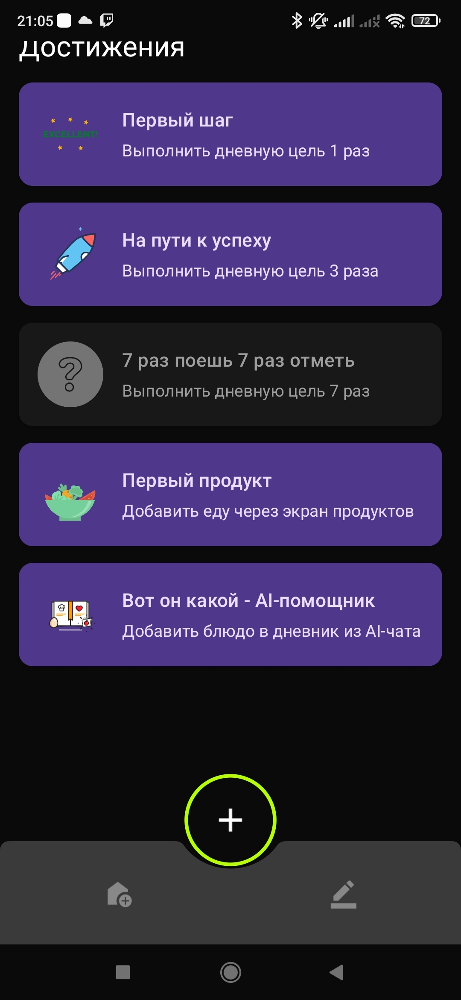
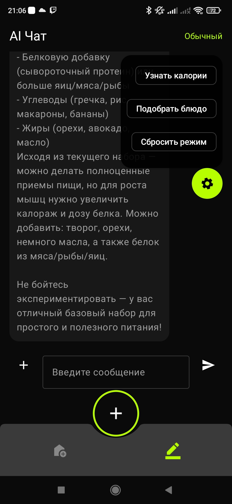
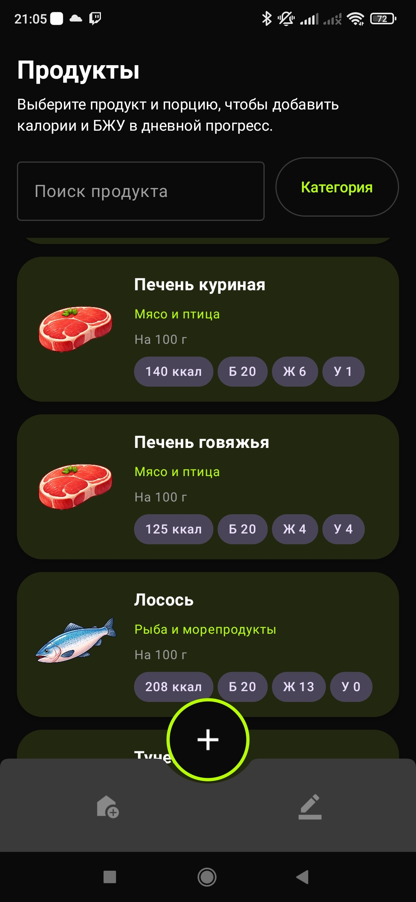
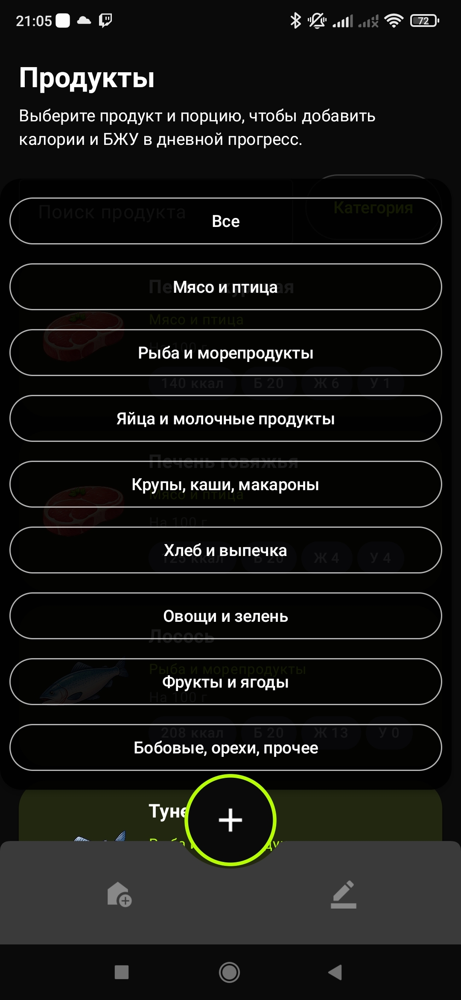

# EatSnap

Приложение для Android на Kotlin, которое помогает следить за питанием, рассчитывает КБЖУ и содержит ИИ-помощника для анализа еды и подбора блюд посредством фотографий.

Данный проект является дипломным. Разработчик: Игнатов П. В.

## Скриншоты

  

## Функционал

- Расчёт дневной нормы калорий и БЖУ по данным профиля пользователя
- Учёт съеденных продуктов с ручным добавлением из базы продуктов
- ИИ-помощник с тремя режимами работы:
    - **Обычный чат** — вопросы и ответы по питанию
    - **Оценка калорий** — определение КБЖУ блюда по фотографии
    - **Подбор блюда** — предложение рецепта по имеющимся продуктам
- Добавление рассчитанных КБЖУ блюд в дневник питания
- Система получения достижений пользователем
- Сохранение профиля, прогресса и истории (Room, DataStore)
- Локальный ИИ на базе Ollama без облачных сервисов

## Стек технологий

| Компонент | Технология                |
|-----------|---------------------------|
| Язык | Kotlin                    |
| UI | Jetpack Compose           |
| Локальная БД | Room, DataStore           |
| Сеть | OkHttp                    |
| Асинхронность | Coroutines, Flow          |
| Архитектура | MVVM + Clean Architecture |
| Сервер | Node.js, Express          |
| Локальная LLM | Ollama, Qwen3.5:4b        |
| Туннелирование | fxtun                     |

## Системные требования

### Android-приложение
- Android 8.0+ (API 26+)
- Минимум 2 ГБ оперативной памяти

### Сервер ИИ
- ОС: Windows 10+
- Видеокарта: NVIDIA (CUDA) или AMD (Vulkan) с минимум 6+ ГБ видеопамяти
- Оперативная память: 8+ ГБ
- Node.js 18+

